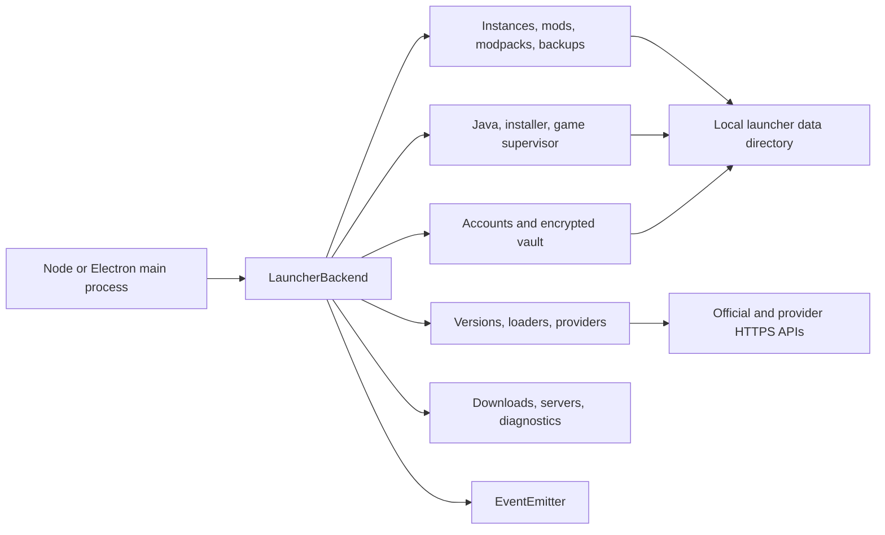
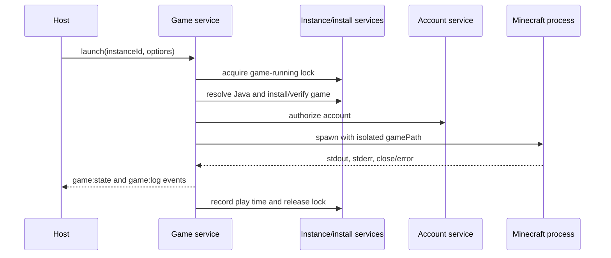

# Cobblestone Advanced Backend Guide

This is the implementation guide for Cobblestone 4.x. It documents the backend
that exists in this repository: its architecture, public API, persistence,
events, security boundaries, Electron integration, lifecycle, failure behavior,
testing, and extension points.

Cobblestone is a local Minecraft Java launcher core. It intentionally contains
no renderer, theme system, branding layer, telemetry service, proprietary
account server, or cloud synchronization. A desktop application is expected to
host this core and provide its own trusted interface.

## Contents

- [Runtime model](#runtime-model)
- [Installation and bootstrap](#installation-and-bootstrap)
- [Backend object and services](#backend-object-and-services)
- [Persistence and data ownership](#persistence-and-data-ownership)
- [Settings](#settings)
- [Accounts and authorization](#accounts-and-authorization)
- [Minecraft versions, Java, loaders, and installation](#minecraft-versions-java-loaders-and-installation)
- [Instances, worlds, logs, and locks](#instances-worlds-logs-and-locks)
- [Downloads and networking](#downloads-and-networking)
- [Content providers](#content-providers)
- [Mods and other managed content](#mods-and-other-managed-content)
- [Modpacks](#modpacks)
- [Backups](#backups)
- [Launching and supervising Minecraft](#launching-and-supervising-minecraft)
- [Server status](#server-status)
- [Diagnostics and maintenance](#diagnostics-and-maintenance)
- [Events](#events)
- [Errors](#errors)
- [Electron IPC adapter](#electron-ipc-adapter)
- [End-to-end workflows](#end-to-end-workflows)
- [Security model](#security-model)
- [Concurrency, atomicity, and recovery](#concurrency-atomicity-and-recovery)
- [Testing, operations, and release checks](#testing-operations-and-release-checks)
- [Extension points](#extension-points)
- [Current boundaries](#current-boundaries)

## Runtime model

The launcher is a long-lived service object created once per application
process. Services share a single data directory, event bus, HTTP policy, and
download scheduler.



The dependency direction is deliberate:

1. Core utilities own paths, JSON writes, encryption, networking, errors, and
   download scheduling.
2. Providers normalize third-party metadata into a common content model.
3. Services implement launcher operations and coordinate core utilities.
4. `LauncherBackend` wires those objects together and exposes them to a host.
5. The optional Electron adapter translates an allowlisted subset into IPC.

The core targets Node.js 22 or later and uses CommonJS.

## Installation and bootstrap

Install dependencies and validate the checkout:

```bash
pnpm install --frozen-lockfile
pnpm check
pnpm test
```

Create one backend instance:

```js
const { createLauncherBackend } = require('./backend');

const launcher = createLauncherBackend({
  dataDir: '/absolute/path/to/cobblestone-data',
  version: '4.0.0',
  userAgent: 'MyLauncher/1.0.0',
});

console.log(launcher.status());

process.once('SIGTERM', async () => {
  await launcher.shutdown();
  process.exit(0);
});
```

`createLauncherBackend(options)` accepts:

| Option | Meaning |
| --- | --- |
| `dataDir` | Absolute or relative data root. Defaults to `COBBLESTONE_DATA_DIR`, then `~/.cobblestone`. |
| `version` | Host version reported by `status()` and the default user agent. |
| `userAgent` | Explicit HTTP user agent. |
| `events` | A compatible `EventEmitter`; useful when the host owns the event bus. |
| `vault` | A replacement async secret store implementing `get`, `set`, and `delete`. |
| `http` | A replacement HTTP client implementing the core client's surface. |
| `fetchImpl` | Fetch implementation used by the default `HttpClient`. |
| `auth.authFactory` | Factory used to create the Microsoft authentication manager. Mainly useful for tests or host-specific auth integration. |

Directories and state files are created during construction. Construction is
therefore local-state-mutating even before a launcher operation is called.

Call `await launcher.shutdown()` before terminating the host. It requests a
graceful stop for all supervised games and emits `backend:shutdown`. Shutdown
does not wait indefinitely for a game that ignores termination.

## Backend object and services

The object returned by `createLauncherBackend()` has the following stable
top-level properties:

| Property | Responsibility |
| --- | --- |
| `version` | Effective backend version. |
| `events` | Shared event emitter. |
| `paths` | Resolved launcher filesystem paths. |
| `vault` | Encrypted or host-provided secret storage. |
| `settings` | Validated launcher preferences. |
| `http` | HTTPS-first request client. |
| `downloads` | Concurrent resumable download manager. |
| `instances` | Instance metadata, files, worlds, logs, and locks. |
| `accounts` | Microsoft and offline profiles. |
| `versions` | Mojang version metadata and caches. |
| `java` | Java discovery, compatibility checks, and managed runtimes. |
| `loaders` | Fabric, Quilt, Forge, and NeoForge catalogs/installers. |
| `installation` | Minecraft and loader installation/repair. |
| `providers` | Modrinth and CurseForge provider registry. |
| `mods` | Managed content install, update, toggle, import, and verification. |
| `modpacks` | Modrinth and CurseForge archive import. |
| `backups` | Full, content, and world backup lifecycle. |
| `game` | Launching, process supervision, logging, and play time. |
| `servers` | Minecraft Java status ping. |
| `diagnostics` | Health checks, integrity checks, storage, and cleanup. |

`launcher.status()` returns a small synchronous snapshot:

```js
{
  name: 'Cobblestone',
  version: '4.0.0',
  dataDirectory: '/path/to/data',
  runningGames: [],
  downloads: [],
  instances: 0,
  accounts: 0,
  providers: ['modrinth', 'curseforge']
}
```

The direct API exposes more operations than the Electron IPC adapter. Treat
service methods not present in the IPC channel table as main-process-only unless
you deliberately add and validate a narrow bridge for them.

## Persistence and data ownership

The default layout is:

```text
<dataDir>/
├── minecraft/
│   ├── assets/
│   ├── libraries/
│   ├── versions/
│   └── instances/<instance-id>/
│       ├── .launcher-content.json
│       ├── .trash/
│       │   ├── content/
│       │   └── worlds/
│       ├── config/
│       ├── logs/
│       ├── mods/
│       ├── resourcepacks/
│       ├── saves/
│       └── shaderpacks/
├── java/
├── backups/
├── cache/
├── downloads/
├── logs/
├── metadata/
│   ├── minecraft-versions.json
│   └── versions/<minecraft-version>.json
├── state/
│   ├── accounts.json
│   ├── instances.json
│   ├── settings.json
│   ├── vault.key
│   └── vault.enc.json
└── trash/
```

Ownership rules:

- Cobblestone owns `state`, `metadata`, `downloads`, `java`, `backups`, and
  launcher-created trash records.
- Shared Minecraft assets, libraries, and installed version profiles live under
  `minecraft` and may be reused by all instances.
- Each instance has its own game directory. Worlds, configuration, logs, mods,
  resource packs, and shader packs are isolated there.
- `.launcher-content.json` is Cobblestone's managed-content manifest. Files not
  listed in it are left alone and reported by `mods.scanUnmanaged()`.
- Do not hand-edit JSON while the backend is running. The in-memory caches and
  serialized write queues assume the backend is the writer.
- Copying a data directory to another machine also copies the local vault key.
  Protect both `vault.key` and `vault.enc.json`; encryption is not useful if an
  attacker can freely read both files and the host account.

JSON stores use an in-process write queue, an advisory file lock, validation,
and atomic replacement. Invalid state is rejected by the relevant validator
when read or written. This protects metadata writes, but it does not turn all
launcher filesystem operations into cross-process transactions.

## Settings

Read, merge-update, or reset settings:

```js
const current = launcher.settings.get();

await launcher.settings.set({
  memory: { maximumMb: 8192 },
  downloads: { concurrency: 10 },
  mods: { releaseChannels: ['release', 'beta'] },
});

await launcher.settings.reset();
```

`set()` deep-merges its input into the current settings, validates the complete
result, persists it, and emits `settings:changed`. A download concurrency change
immediately updates the scheduler. `downloads.allowInsecureHttp` immediately
updates the HTTP policy.

The schema is:

```js
{
  schemaVersion: 1,
  memory: {
    minimumMb: 1024,       // 512..262144
    maximumMb: 4096,       // 512..262144
    autoAdjust: true
  },
  java: {
    autoManage: true,
    paths: { '8': '/java8', '17': '/java17', '21': '/java21' }
  },
  game: {
    width: 1280,           // 320..16384
    height: 720,           // 240..16384
    fullscreen: false,
    jvmArguments: [],      // at most 128 strings, each at most 512 chars
    gameArguments: []
  },
  downloads: {
    concurrency: 6,        // 1..32
    retries: 3,            // 0..12
    timeoutMs: 120000,     // 1000..3600000
    allowInsecureHttp: false
  },
  instances: {
    autoBackupBeforeUpdates: true,
    backupRetention: 10,   // 1..100
    keepFailedInstallations: false
  },
  mods: {
    preferredProvider: 'modrinth',
    releaseChannels: ['release'],
    installRequiredDependencies: true,
    updatePinned: false
  },
  privacy: {
    diagnosticsIncludePaths: false,
    networkLogging: false
  }
}
```

There are intentionally no appearance, theme, branding, frontend, or cloud
settings.

Implementation note: `memory.autoAdjust`, `downloads.timeoutMs`,
`instances.keepFailedInstallations`, and `privacy.networkLogging` are validated
and persisted for forward compatibility, but are not currently consumed by all
corresponding runtime paths. In particular, failed modpack imports are retained
as `broken` regardless of `keepFailedInstallations`; file transfers currently
use their own explicit timeout. Do not promise these controls in a UI until the
runtime behavior is connected and tested.

## Accounts and authorization

### Account metadata

`accounts.list()` returns:

```js
{
  schemaVersion: 1,
  activeId: 'profile-id-or-null',
  accounts: [{
    id: 'profile-id',
    type: 'microsoft', // or 'offline'
    username: 'Player',
    uuid: 'minecraft-profile-id-or-null',
    createdAt: 1720000000000,
    lastAuthenticatedAt: 1720000000000
  }]
}
```

Account JSON never contains access tokens or refresh material. Microsoft
refresh data is stored under `microsoft:<account-id>` in the vault. Access
tokens live in memory and are returned only to internal launch authorization.

### Microsoft login

```js
launcher.events.on('auth:progress', ({ stage, message }) => {
  console.log(stage, message);
});

const account = await launcher.accounts.loginMicrosoft();
```

The login uses `msmc`, requests account selection, and launches its raw
system-browser flow. Concurrent calls share one login promise, preventing two
overlapping sign-in sessions. On success, the Minecraft profile becomes active,
refresh material is encrypted, and `auth:changed` is emitted.

`accounts.authorization(id)` refreshes an expired session when possible and
returns the XMCL-compatible launch authorization. A missing or expired refresh
session produces `AUTHENTICATION_ERROR` and requires sign-in again.

### Offline profiles

```js
const offline = await launcher.accounts.addOffline('LocalPlayer');
await launcher.accounts.setActive(offline.id);
```

Offline names must match `[A-Za-z0-9_]{1,16}`. Cobblestone derives the standard
offline UUID during launch. An offline profile is a local launch identity; it
does not grant game ownership, online-mode server access, Microsoft services,
or permission to redistribute Minecraft.

Other operations:

```js
launcher.accounts.get();          // active account
launcher.accounts.get(accountId); // specific account
await launcher.accounts.remove(accountId);
```

Removing the active account selects the first remaining account, if any, and
removes its encrypted Microsoft refresh record.

## Minecraft versions, Java, loaders, and installation

### Version metadata

```js
const releases = await launcher.versions.list({
  types: ['release'],
  limit: 20,
  force: false,
});

const manifest = await launcher.versions.manifest();
const metadata = await launcher.versions.metadata('1.21.1');
const manifestEntry = await launcher.versions.entry('1.21.1');
const requiredJava = await launcher.versions.requiredJava('1.21.1');
const installed = launcher.versions.installedProfiles();
```

The Mojang manifest cache has a 15-minute freshness window. If refresh fails
and a cached manifest exists, the cache is returned. Per-version metadata is
cached on disk without an expiry and may be refreshed by clearing that specific
cache file. `fallbackJava(id)` maps legacy releases to Java 8, modern releases
to Java 17, and Minecraft 1.20.5 or newer to Java 21 when Mojang metadata is not
available.

### Java runtimes

```js
const runtimes = await launcher.java.detect();
const probe = await launcher.java.probe('/path/to/java');
const javaPath = await launcher.java.ensureForMinecraft('1.21.1');
const managedPath = await launcher.java.install(21);
```

Runtime selection order is:

1. Validate an instance `overrides.javaPath`, if supplied.
2. Validate the configured path for the required Java major.
3. Look for a Cobblestone-managed runtime.
4. Detect a compatible system runtime and remember it.
5. Download an Eclipse Adoptium JRE if `java.autoManage` is enabled.

Managed majors are 8, 17, 21, and 25. Adoptium archives are staged, extracted,
probed, and only then moved into the active major directory. A previous managed
runtime is moved into launcher trash before replacement. Java 8 requires Java
8 exactly; later requirements accept the same or a newer major.

### Loader catalogs and resolution

Supported loaders are `vanilla`, `fabric`, `quilt`, `forge`, and `neoforge`.

```js
const choices = await launcher.loaders.versions('fabric', '1.21.1');
const recommended = await launcher.loaders.recommended('forge', '1.20.1');
const selected = await launcher.loaders.resolve(instance);
```

If an instance does not pin `loaderVersion`, resolution chooses the first
stable catalog entry, then the first entry as fallback. `loaders.install()` is
normally coordinated by `installation`; hosts should not call it independently
unless they also provide a validated Java path and update instance metadata.

### Installation and repair

```js
const alreadyPresent = launcher.installation.installed(instance.id);
const readyInstance = await launcher.installation.install(instance.id);
const repaired = await launcher.installation.install(instance.id, { repair: true });
```

Installation holds the instance operation lock, resolves Java, downloads and
verifies the official client, libraries, assets, then installs the selected
loader. Instance state moves through `installing` to `ready`; an error marks it
`broken`. `game:install` and `loader:install` events expose phase changes.

`installation.installUnlocked()` is an internal coordination primitive used by
the game service after it already acquired the instance lock. Calling it from a
host bypasses lock acquisition and Java resolution and is not recommended.

## Instances, worlds, logs, and locks

### Instance schema

```js
{
  id: 'uuid-or-safe-custom-id',
  name: 'Fabric Survival',
  minecraftVersion: '1.21.1',
  loader: 'fabric',
  loaderVersion: null,
  resolvedVersionId: null,
  icon: null,
  createdAt: 1720000000000,
  updatedAt: 1720000000000,
  lastPlayedAt: null,
  playTimeSeconds: 0,
  installState: 'new', // new | installing | ready | broken
  managedPack: null,   // or { provider, projectId, versionId }
  overrides: {
    memory: null,      // or { minimumMb, maximumMb }
    javaPath: null,
    jvmArguments: null,
    gameArguments: null,
    resolution: null   // or { width, height, fullscreen }
  }
}
```

Custom IDs must match `[a-zA-Z0-9._-]{1,100}`. Names are 1–120 characters.
Minecraft and loader versions reject slashes and NUL bytes.

### CRUD and recovery

```js
const instance = await launcher.instances.create({
  name: 'Fabric Survival',
  minecraftVersion: '1.21.1',
  loader: 'fabric',
});

await launcher.instances.update(instance.id, {
  overrides: {
    ...instance.overrides,
    memory: { minimumMb: 2048, maximumMb: 8192 },
  },
});

const copy = await launcher.instances.duplicate(instance.id, 'Testing Copy');
await launcher.instances.delete(copy.id);                // recoverable
await launcher.instances.restore(copy.id);
await launcher.instances.delete(copy.id, { permanent: true });
```

Recoverable deletion moves the directory into `<dataDir>/trash` and records
metadata in `instances.json`. Permanent deletion recursively removes only the
resolved instance directory. An active instance operation prevents deletion.

### Files, worlds, and logs

```js
launcher.instances.directory(instance.id, 'mods');
launcher.instances.listFiles(instance.id, 'mods');
launcher.instances.worlds(instance.id);
launcher.instances.readLog(instance.id, { lines: 800, maxBytes: 4 * 1024 * 1024 });
launcher.instances.crashReports(instance.id);

const deleted = await launcher.instances.deleteWorld(instance.id, 'My World');
launcher.instances.deletedWorlds(instance.id);
await launcher.instances.restoreWorld(instance.id, deleted.trashName, 'Recovered World');
```

World deletion is recoverable inside the instance. Restore fails instead of
overwriting an existing world. `readLog()` reads only the tail of `latest.log`
and applies both a line count and byte limit.

### Operation locks

Only one coordinated operation may own an instance at a time:

```js
await launcher.instances.withLock(instance.id, 'my-operation', async () => {
  // Main-process-only work scoped to this instance.
});

launcher.instances.busy(instance.id); // operation name or null
```

Installation, running the game, duplication, mod operations, modpack import,
and backups use these locks. Locks are in-process, not cross-process. Do not run
two Cobblestone backend processes against the same data directory.

## Downloads and networking

### Download tasks

```js
const result = await launcher.downloads.download({
  id: 'optional-stable-id',
  urls: ['https://primary.example/file', 'https://mirror.example/file'],
  destination: '/absolute/managed/path/file.jar',
  hashes: { sha256: 'expected-lower-or-uppercase-hash' },
  size: 123456,
  headers: {},
  priority: 10,
  retries: 4,
});
```

The returned promise resolves to `{ id, path, bytes, url }`. A public task
snapshot contains:

```js
{
  id,
  status,       // queued | running | retrying | verifying | paused |
                // completed | failed | cancelled
  destination,
  received,
  total,
  speed,
  percent,
  createdAt,
  updatedAt,
  error         // null or { code, message }
}
```

Control and inspection:

```js
launcher.downloads.list();
launcher.downloads.get(taskId);
launcher.downloads.pause(taskId);
launcher.downloads.resume(taskId);
launcher.downloads.cancel(taskId, { discardPartial: true });
launcher.downloads.setConcurrency(8);
```

Downloads are prioritized, FIFO within a priority, deduplicated by resolved
destination, resumed from `.part` files with HTTP Range, and atomically moved
into place after size/hash verification. Unsupported hash algorithms are
ignored; callers that require integrity must supply an algorithm available in
Node's `crypto.getHashes()`.

Pausing or cancelling aborts the active request. A paused task retains its
partial file. Cancelling retains the partial unless `discardPartial` is true.
Retries rotate through mirrors and use capped exponential backoff.

### HTTP policy

The default client:

- accepts HTTPS only;
- allows HTTP only when `downloads.allowInsecureHttp` is explicitly enabled;
- follows redirects;
- applies timeouts and retry handling;
- retries HTTP 408, 425, 429, and 5xx failures;
- truncates remote error bodies before placing them in error details.

The setting named `downloads.timeoutMs` is part of persisted configuration, but
generic service requests currently use the explicit/default timeouts in
`HttpClient`, while file transfers use a 10-minute request timeout. Treat this
setting as reserved until every call path is wired to it.

## Content providers

The provider registry currently contains `modrinth` and `curseforge`:

```js
launcher.providers.list();
launcher.providers.get('modrinth');
await launcher.providers.search('modrinth', {
  query: 'Sodium',
  minecraftVersion: '1.21.1',
  loader: 'fabric',
  projectType: 'mod',
  offset: 0,
  limit: 20,
});
```

Search returns `{ total, items }`. Provider implementations normalize projects,
versions, dependencies, files, hashes, release channels, Minecraft versions,
and loader data so content services do not depend on raw provider responses.

### Modrinth

Main provider methods:

```js
const provider = launcher.providers.get('modrinth');
await provider.search(query);
await provider.project(projectIdOrSlug);
await provider.versions(projectId, { minecraftVersion, loader, channels });
await provider.version(versionId);
provider.selectFile(version);
await provider.versionsFromHashes(['sha512-hash'], 'sha512');
```

Search supports `projectType` values understood by Modrinth. Version selection
filters by the supplied Minecraft version, loader, and `release`, `beta`, or
`alpha` channels.

### CurseForge

CurseForge requires a host-supplied approved third-party API key:

```js
const curseforge = launcher.providers.get('curseforge');
await curseforge.setApiKey(process.env.MY_CURSEFORGE_KEY);
console.log(await curseforge.configured());
```

An empty key removes the stored key. The key is encrypted by the vault. It must
not be embedded in renderer code, logs, source control, or support snapshots.

CurseForge methods are similar, except direct version lookup needs both IDs:

```js
await curseforge.search(query);
await curseforge.project(projectId);
await curseforge.versions(projectId, filters);
await curseforge.version(projectId, fileId);
await curseforge.selectFile(version);
```

If an author disables third-party downloads, Cobblestone asks the official API
for a download URL and returns `CONFIGURATION_ERROR` when none is provided. It
does not scrape pages or bypass the author's distribution setting.

## Mods and other managed content

Despite the service name, `mods` manages four folders:

| Project/content type | Instance folder |
| --- | --- |
| `mod` | `mods` |
| `resourcepack` | `resourcepacks` |
| `shader` | `shaderpacks` |
| `datapack` | `datapacks` |

### Install from a provider

```js
const entry = await launcher.mods.install(instance.id, {
  provider: 'modrinth',
  projectId: 'P7dR8mSH',
  versionId: undefined,       // newest compatible version when omitted
  channels: ['release'],
  dependencies: true,
  folder: undefined,
});
```

The service selects a compatible version using the instance Minecraft version
and loader, recursively installs required dependencies, rejects modpacks, checks
for filename conflicts, verifies provider hashes, and records the result in
`.launcher-content.json`.

Managed entry shape:

```js
{
  key: 'modrinth:project-id',
  provider: 'modrinth',
  projectId: 'project-id',
  versionId: 'version-id',
  title: 'Project title',
  versionNumber: '1.2.3',
  filename: 'project.jar',
  folder: 'mods',
  hashes: { sha512: '...', sha1: '...' },
  size: 123456,
  enabled: true,
  pinned: false,
  installedAt: 1720000000000,
  updatedAt: 1720000000000,
  dependencies: []
}
```

Dependency traversal uses a visited set to break cycles. Required dependencies
stay within the same provider. Optional dependencies are recorded but not
automatically installed.

### Local import

```js
await launcher.mods.importLocal(instance.id, '/path/to/file.jar', {
  folder: 'mods',
  title: 'My local build',
});
```

Local imports validate extensions, calculate SHA-256, copy through a temporary
file, are pinned by default, and use `local:<sha256>` as their key. Allowed
extensions are `.jar`/`.zip` for mods and `.zip` for other content folders.

### Updates, enablement, pinning, removal, verification

```js
const content = launcher.mods.list(instance.id);
const updates = await launcher.mods.checkUpdates(instance.id);
const results = await launcher.mods.updateAll(instance.id);

await launcher.mods.setEnabled(instance.id, entry.key, false);
await launcher.mods.setPinned(instance.id, entry.key, true);
await launcher.mods.remove(instance.id, entry.key);

const integrity = await launcher.mods.verify(instance.id);
const unmanaged = launcher.mods.scanUnmanaged(instance.id);
```

Disabled files gain a `.disabled` suffix. Removal moves a file into the
instance content trash and removes its manifest entry. There is currently no
public content-trash restore operation; recovery is manual or through a backup.

Pinned provider entries do not update unless `mods.updatePinned` is enabled.
Local entries never update. Before a bulk update, Cobblestone creates a content
backup when `instances.autoBackupBeforeUpdates` is enabled. Each update result
is isolated as `{ ok, entry, error? }`, so one failed project does not hide
successful updates.

Verification reports `missing`, `hash-mismatch`, or `unverified` when no usable
stored hash exists. Unmanaged scanning reports files without deleting or
importing them.

## Modpacks

Install a provider pack or local archive:

```js
const instance = await launcher.modpacks.installFromProvider({
  provider: 'modrinth',
  projectId: 'pack-project-id',
  versionId: 'optional-version-id',
  name: 'Optional instance name',
});

const imported = await launcher.modpacks.installArchive('/path/to/pack.mrpack', {
  name: 'Imported Pack',
});
```

Supported formats:

- Modrinth archives containing `modrinth.index.json`;
- CurseForge archives containing `manifest.json`.

The importer creates a new instance, derives Minecraft and loader versions,
downloads required client files, applies client overrides, and sets the instance
to `ready`. It excludes Modrinth files marked unsupported on the client and
CurseForge files marked `required: false`.

Safety limits are 2 GiB for the archive, 512 MiB per declared entry, and 8 GiB
total declared extracted size. Every override/download target is resolved inside
the instance and managed write paths reject symlink components.

Failure behavior is recoverable, not all-or-nothing: an import error marks the
new instance `broken` and retains its partial directory for diagnosis or manual
deletion. Provider-downloaded temporary archives are removed in a `finally`
block.

CurseForge imports require a configured API key and respect files for which a
third-party download URL is unavailable.

## Backups

Create, inspect, restore, and prune backups:

```js
const backup = await launcher.backups.create(instance.id, {
  kind: 'full',       // full | content | worlds
  reason: 'manual',
});

launcher.backups.list(instance.id);
await launcher.backups.restore(backup.filename);
await launcher.backups.restore(backup.filename, { targetInstanceId: anotherId });
await launcher.backups.prune(instance.id);
```

Backup contents:

| Kind | Included paths |
| --- | --- |
| `worlds` | `saves` |
| `content` | `mods`, `config`, `resourcepacks`, `shaderpacks`, content manifest |
| `full` | worlds, managed content/configuration, screenshots, `options.txt`, `servers.dat` |

Each ZIP includes `backup.json` with schema version, instance snapshot, kind,
reason, and timestamp. Symbolic links are skipped. Retention is enforced after
creation using `settings.instances.backupRetention`.

Restore writes included files into an existing instance. It validates every
target path and does not remove unrelated files first; it is an overlay restore,
not a byte-for-byte rollback. Back up the destination before restoring when
unrelated newer files must remain recoverable.

## Launching and supervising Minecraft

### Launch

```js
const session = await launcher.game.launch(instance.id, {
  accountId: undefined, // active account by default
  server: 'play.example.net:25565',
  quickPlayPath: undefined,
});
```

Launch performs this sequence:



Global settings are merged with instance overrides for memory, Java, resolution,
JVM arguments, and game arguments. The instance directory becomes `gamePath`;
shared assets/libraries/versions use the launcher `minecraft` root.

`server` accepts a host string with optional port or an XMCL-compatible server
object. `quickPlayPath` is passed as the singleplayer quick-play target.

The returned session summary is `{ launchId, instanceId, pid, startedAt }`.
Only one launch or game process is allowed per instance, but different instances
may run concurrently.

### Observe and stop

```js
launcher.game.list();
launcher.game.status(instance.id);
await launcher.game.stop(instance.id, { forceAfterMs: 10_000 });
await launcher.game.stopAll();
```

Stop sends `SIGTERM`, then `SIGKILL` after the timeout if the process is still
registered. On exit, the service records play time, releases the operation lock,
and emits a final `stopped` or `failed` state.

Stdout and stderr are redacted for common access-token patterns before they are
emitted or appended to `<dataDir>/logs/game-<launchId>.log`. Hosts must still
treat game logs as potentially sensitive because mods can print arbitrary user
or system data.

## Server status

```js
const status = await launcher.servers.ping('play.example.net', {
  timeoutMs: 6000,
});
```

The service supports hostname/IPv4 with optional port and bracketed IPv6. When
no port is specified it tries `_minecraft._tcp` SRV lookup, then port 25565. An
online response includes latency, plain description, player counts/sample,
version, validated data-URL favicon, and secure-chat enforcement when supplied.
Expected network failures resolve to `{ online: false, error }` rather than
throwing.

## Diagnostics and maintenance

```js
const report = await launcher.diagnostics.doctor({ network: true });
const localOnly = await launcher.diagnostics.doctor({ network: false });
const storage = launcher.diagnostics.storage();
const verification = await launcher.diagnostics.verifyInstance(instance.id);
const cleanup = await launcher.diagnostics.cleanup({
  partialOlderThanMs: 7 * 24 * 60 * 60_000,
});
const snapshot = launcher.diagnostics.supportSnapshot();
```

`doctor()` checks data-directory writes, settings, instances, and local Java. In
network mode it also checks Mojang metadata, Modrinth search, and whether
CurseForge is configured. A missing CurseForge key is reported as
`configured: false`, not a failed health check.

`storage()` measures instances, assets, libraries, versions, Java, cache,
downloads, backups, and trash. Directory measurement is synchronous; avoid
calling it repeatedly on a UI-critical main-process path for very large data
sets.

`verifyInstance()` checks managed content hashes, finds matching installed
version profiles, and lists unmanaged content. `cleanup()` recursively removes
old `.part` or `.staging-` files only beneath downloads and cache.

`supportSnapshot()` removes configured Java paths and instance icons. Absolute
storage paths are reduced to basenames unless
`privacy.diagnosticsIncludePaths` is true. Review the returned object before
sharing it because instance names and metadata are still included.

## Events

Subscribe on the shared emitter:

```js
const onState = (payload) => console.log(payload);
launcher.events.on('game:state', onState);
launcher.events.off('game:state', onState);
```

Events produced by the current backend:

| Event | Payload summary |
| --- | --- |
| `auth:progress` | `{ stage, message }` during Microsoft login. |
| `auth:changed` | Complete account-store snapshot. |
| `settings:changed` | Complete validated settings object. |
| `download:progress` | Public download task snapshot. |
| `instance:created` | New instance object. |
| `instance:updated` | Updated instance object. |
| `instance:deleted` | `{ id, permanent }`. |
| `instance:restored` | Restored instance object. |
| `instance:operation` | `{ id, operation, status: 'started'|'finished' }`. |
| `world:deleted` | `{ instanceId, worldName, trashName }`. |
| `world:restored` | `{ instanceId, worldName }`. |
| `content:install` | Downloading/completed content state. |
| `content:removed` | `{ instanceId, key }`. |
| `modpack:progress` | `{ instanceId, completed, total }`. |
| `backup:created` | Backup result plus `instanceId`. |
| `backup:restored` | `{ instanceId, filename }`. |
| `java:install` | Downloading/extracting/completed/failed runtime state. |
| `loader:install` | Loader identity and installing/completed state. |
| `game:install` | Minecraft/loader phase, completion, or failure. |
| `game:state` | Launch ID, instance ID, status, detail, and optional process result. |
| `game:log` | `{ instanceId, launchId, level, line }`, after redaction. |
| `backend:shutdown` | No payload, after stop requests are issued. |

Events are process-local and ephemeral. They are progress signals, not an audit
log. A listener attached after an event will not replay prior state; query the
corresponding service for the current snapshot.

Event listeners should be fast and should handle their own exceptions. The
default emitter enables `captureRejections`, but the backend does not install a
global persistence or recovery policy for rejected event handlers.

## Errors

Expected failures derive from `LauncherError` and have a stable `code`, human
message, and optional structured `details`:

| Code | Meaning |
| --- | --- |
| `VALIDATION_ERROR` | Invalid input, unsafe path, filename, archive, or setting. |
| `NOT_FOUND` | Requested account, instance, version, content, backup, or provider is absent. |
| `CONFLICT` | Busy instance, duplicate ID/task, existing destination, or active game. |
| `NETWORK_ERROR` | Request, timeout, cancellation, status, or response failure. |
| `INTEGRITY_ERROR` | Size/hash mismatch or malformed downloaded/archive content. |
| `AUTHENTICATION_ERROR` | Login, profile, refresh, or session failure. |
| `CONFIGURATION_ERROR` | Missing provider key, incompatible Java, loader, or unavailable permitted download. |
| `VAULT_ERROR` | Invalid key or undecryptable encrypted secret data. |
| `UNEXPECTED_ERROR` | Serialization fallback for an unclassified exception. |

Use the exported classes and serializer:

```js
const { errors } = require('./backend');

try {
  await launcher.installation.install(instanceId);
} catch (error) {
  const safe = errors.serializeError(error);
  console.error(safe.code, safe.message, safe.details);
}
```

`serializeError()` returns only `{ name, code, message, details }`; it does not
expose stack traces or nested causes over IPC. Log stacks only in a trusted
main-process destination and apply redaction appropriate to the host.

## Electron IPC adapter

Cobblestone does not create a window, preload, renderer, or navigation policy.
The optional adapter registers a narrow main-process interface:

```js
const path = require('node:path');
const { app, ipcMain } = require('electron');
const { createLauncherBackend } = require('./backend');
const { registerElectronIpc } = require('./backend/adapters/electron-ipc');

let disposeIpc;
let launcher;

app.whenReady().then(() => {
  launcher = createLauncherBackend({ dataDir: app.getPath('userData') });

  disposeIpc = registerElectronIpc({
    ipcMain,
    backend: launcher,
    validateSender: (frame) => {
      if (!frame) return false;
      const trusted = new URL(frame.url);
      return trusted.protocol === 'app:' && trusted.host === 'launcher';
    },
    eventSink: (name, payload) => {
      // Send only to the already validated, expected window.
      trustedWindow?.webContents.send('cobblestone:event', { name, payload });
    },
  });
});

app.on('before-quit', async (event) => {
  // A production host should guard against re-entering this async shutdown.
  disposeIpc?.();
  await launcher?.shutdown();
});
```

`validateSender` is mandatory. Each handler returns one of these envelopes:

```js
{ ok: true, value: result }
{ ok: false, error: { name?, code, message, details? } }
```

An untrusted frame receives `{ ok: false, error: { code:
'UNTRUSTED_SENDER', ... } }` without dispatching the operation.

Registered channels:

| Namespace | Channels |
| --- | --- |
| Core/settings | `core:status`, `settings:get`, `settings:set` |
| Accounts | `accounts:list`, `accounts:loginMicrosoft`, `accounts:addOffline`, `accounts:setActive`, `accounts:remove` |
| Catalog | `versions:list`, `versions:metadata`, `loaders:list` |
| Instances | `instances:list`, `instances:create`, `instances:update`, `instances:duplicate`, `instances:delete`, `instances:restore`, `instances:files`, `instances:worlds`, `instances:deleteWorld`, `instances:deletedWorlds`, `instances:restoreWorld`, `instances:readLog`, `instances:crashReports` |
| Installation | `installation:status`, `installation:install`, `installation:repair` |
| Providers | `providers:search`, `providers:curseforgeConfigured`, `providers:setCurseforgeKey` |
| Content | `mods:list`, `mods:install`, `mods:importLocal`, `mods:remove`, `mods:setEnabled`, `mods:setPinned`, `mods:updates`, `mods:updateAll`, `mods:verify` |
| Modpacks | `modpacks:installProvider`, `modpacks:installArchive` |
| Backups | `backups:create`, `backups:list`, `backups:restore` |
| Game | `game:launch`, `game:stop`, `game:list` |
| Downloads | `downloads:list`, `downloads:pause`, `downloads:resume`, `downloads:cancel` |
| Server/diagnostics | `servers:ping`, `diagnostics:doctor`, `diagnostics:storage`, `diagnostics:verifyInstance`, `diagnostics:cleanup` |

The adapter forwards this subset through `eventSink`:

```text
auth:progress, auth:changed, settings:changed, download:progress,
instance:created, instance:updated, instance:deleted, instance:operation,
content:install, content:removed, modpack:progress, backup:created,
game:install, game:state, game:progress, game:log, java:install,
loader:install
```

`game:progress` is reserved by the adapter but is not currently produced by a
backend service. Some produced events, including restore/world/backup-restore
and shutdown events, are not forwarded. Add them deliberately if the future UI
needs them.

The future renderer should receive an explicit method per operation from a
sandboxed, context-isolated preload. Never expose raw `ipcRenderer`, arbitrary
channel names, filesystem paths, shell execution, the backend object, vault, or
provider secrets to renderer code.

## End-to-end workflows

### Create, install, and launch

```js
const launcher = createLauncherBackend({ dataDir });

let account = launcher.accounts.list().accounts[0];
if (!account) account = await launcher.accounts.loginMicrosoft();

const instance = await launcher.instances.create({
  name: 'Cobblestone Fabric',
  minecraftVersion: '1.21.1',
  loader: 'fabric',
});

await launcher.installation.install(instance.id);
await launcher.game.launch(instance.id, { accountId: account.id });
```

### Search, install, back up, and update content

```js
const results = await launcher.providers.search('modrinth', {
  query: 'Sodium',
  minecraftVersion: instance.minecraftVersion,
  loader: instance.loader,
  projectType: 'mod',
});

await launcher.mods.install(instance.id, {
  provider: 'modrinth',
  projectId: results.items[0].projectId,
});

console.log(await launcher.mods.verify(instance.id));
console.log(await launcher.mods.checkUpdates(instance.id));

// updateAll creates a content backup first when the setting is enabled.
console.log(await launcher.mods.updateAll(instance.id));
```

### Import a modpack and inspect failure

```js
let imported;
try {
  imported = await launcher.modpacks.installArchive('/packs/example.mrpack');
} catch (error) {
  console.error(errors.serializeError(error));
  const broken = launcher.instances.list().filter((item) => item.installState === 'broken');
  console.error('Broken imports retained for review:', broken);
}
```

### Recommended host startup and shutdown

1. Create one backend after the Electron app is ready.
2. Attach event listeners before starting long operations.
3. Register IPC only after the trusted protocol/window policy is known.
4. Run `diagnostics.doctor({ network: false })` and surface local failures.
5. On quit, stop accepting new commands, dispose IPC, and call `shutdown()`.
6. Allow a bounded grace period before the host exits.

## Security model

### Trust boundaries

- The Node/Electron main process is trusted and has local filesystem access.
- Renderer content is untrusted even when bundled with the application.
- Provider APIs, metadata, archives, filenames, hashes, mods, modpacks, and game
  logs are untrusted input.
- Microsoft refresh data and CurseForge keys are secrets.
- Instance files may contain third-party executable code and user data.

### Enforced controls

- `resolveInside()` rejects path traversal outside an allowed root.
- `safeFilename()` rejects separators, empty names, NUL, and unsafe platform
  filename characters.
- Managed writes reject symlinked parent components to reduce link-based
  escapes. The data root must still be private to the launcher OS user.
- Modpack extraction has archive, entry, and total expansion limits.
- Download destinations are replaced atomically only after optional size/hash
  verification.
- HTTP is HTTPS-only by default.
- Vault secrets use AES-256-GCM with a random 256-bit local key and random
  96-bit IV; key and ciphertext are written with mode `0600` where supported.
- Microsoft refresh material and CurseForge keys stay out of plain JSON.
- Game logs redact common access-token representations.
- Electron IPC requires explicit sender validation and serializes errors.
- CurseForge author download restrictions are honored.
- No telemetry or cloud transport is present.

### Host responsibilities

- Keep Electron current and enable `sandbox`, `contextIsolation`, and a strict
  Content Security Policy.
- Disable Node integration in renderers.
- Validate navigation, new windows, permissions, downloads, and external URLs.
- Use a custom application protocol or an exact trusted-file allowlist. Avoid
  prefix checks that can accept lookalike URLs.
- Never pass arbitrary renderer-supplied filesystem destinations to direct
  backend/core methods.
- Keep the data directory private to the OS user and consider an OS credential
  store by injecting a vault.
- Treat mods and modpacks as executable third-party software. Cobblestone checks
  integrity and containment; it cannot prove that a mod is benign.
- Rate-limit expensive renderer requests such as storage scans, provider search,
  diagnostics, and repeated installations.
- Review support data and logs before upload.
- Obtain and protect provider credentials according to provider terms.

### Vault limitations

The default encrypted file vault protects against casual plaintext disclosure
and copying only the ciphertext. It does not protect secrets from malware or a
process that can read the running user's files, because the key is stored beside
the encrypted data. Production desktop hosts should prefer an OS keychain-backed
vault with the same async interface.

## Concurrency, atomicity, and recovery

| Area | Guarantee | Boundary |
| --- | --- | --- |
| JSON state | Serialized, validated, atomic replacement | One backend process per data directory |
| Vault writes | Serialized and authenticated encryption | Local key is file-backed by default |
| Downloads | Bounded concurrency, destination deduplication, resumable partials | Task history is in-memory and not restored after restart |
| Instance operations | One named in-process lock per instance | No cross-process locking |
| Content install | Verified file then manifest update; previous version trashed after replacement | A crash between file and manifest operations can require verification/manual repair |
| Bulk updates | Optional pre-update content backup; per-project results | Not a single transaction across all projects |
| Modpack import | Safe contained writes; broken instance retained on error | Partial pack is not automatically rolled back |
| Backup restore | Contained overlay write under a lock | Does not remove files absent from the archive |
| Game process | One session per instance and lock until exit | Host process crash cannot gracefully record final play time |

Recovery tools:

- Resume retained `.part` downloads by repeating a download to the same target.
- Run `diagnostics.cleanup()` to remove old partial/staging files.
- Run `diagnostics.verifyInstance()` after an interrupted content operation.
- Repair Minecraft files with `installation.install(id, { repair: true })`.
- Restore instances/worlds through their trash APIs.
- Restore content/world/full state from a backup.
- Delete or duplicate a retained `broken` modpack instance after inspection.

## Testing, operations, and release checks

### Commands

```bash
pnpm check
pnpm test
pnpm test:coverage
pnpm doctor
node backend/cli.js doctor --offline
node backend/cli.js status
node backend/cli.js versions 10
node backend/cli.js instances
node backend/cli.js storage
node backend/cli.js search modrinth sodium
pnpm audit --prod
```

`pnpm check` syntax-checks backend and test JavaScript. Tests use Node's built-in
test runner. CI installs with the frozen lockfile, then runs checks and tests on
Node 22.

The CLI is an operator/developer surface, not a stable renderer protocol. It
prints JSON on stdout and `CODE: message` on stderr.

### Test layers

For new backend features, cover:

1. Pure parsing/validation behavior with no network.
2. Filesystem behavior in a unique temporary data directory.
3. Service behavior with injected HTTP/auth/vault fakes.
4. Concurrency, cancellation, retry, and interruption cases.
5. Path traversal, unsafe archive, symlink, filename, and conflict cases.
6. An opt-in live smoke test for provider metadata when appropriate; do not make
   ordinary unit tests depend on third-party availability.

### Release checklist

Before shipping a host application:

1. Pin and audit production dependencies.
2. Run syntax checks, unit tests, coverage review, and production audit.
3. Exercise Microsoft sign-in and refresh with a real owned account.
4. Install and launch representative Vanilla, Fabric, Quilt, Forge, and
   NeoForge instances.
5. Test managed Java on each supported OS/architecture.
6. Test Modrinth and CurseForge installs, dependencies, disabled third-party
   downloads, updates, and failed hashes.
7. Import representative `.mrpack` and CurseForge archives, including malicious
   traversal/oversize fixtures.
8. Test backup/restore and instance/world trash recovery.
9. Verify Electron sender, navigation, preload, CSP, sandbox, and permission
   policies.
10. Confirm secrets and access tokens are absent from logs, crash reports,
    packaged source, renderer bundles, and support snapshots.

## Extension points

### Replace the vault

```js
class KeychainVault {
  async get(key) { /* return parsed secret or null */ }
  async set(key, value) { /* persist atomically */ }
  async delete(key) { /* remove if present */ }
}

const launcher = createLauncherBackend({ vault: new KeychainVault() });
```

Vault implementations must serialize safely, preserve structured values used by
`msmc`, reject corrupt records, and never expose values to the renderer.

### Inject HTTP for tests or policy

Use `fetchImpl` when the default `HttpClient` behavior is desired with a custom
transport. Inject `http` only when the replacement implements at least
`validateUrl`, `request`, and `json`, including expected error and abort behavior.

```js
const launcher = createLauncherBackend({
  fetchImpl: async (url, init) => testRouter(url, init),
});
```

Note that XMCL installer calls currently use `globalThis.fetch` directly in
some installation paths. Injecting `fetchImpl` controls Cobblestone's HTTP
client, not every XMCL internal request.

### Add a content provider

A provider used by `ModService` should expose:

```js
{
  id,
  search(options),
  project(projectId),
  versions(projectId, filters),
  version(/* provider-specific identifiers */),
  selectFile(normalizedVersion)
}
```

It must normalize project types to Cobblestone's folder mapping and versions to
the fields shown in the managed-content section. The current registry is built
inside `LauncherBackend`; adding a provider requires constructing/registering
it there or extending the registry after bootstrap in trusted main-process code:

```js
launcher.providers.providers.set(customProvider.id, customProvider);
```

Directly mutating the internal map is possible but not a promised public API.
A future formal extension should add `register()` with interface validation and
provider-specific direct-version lookup normalization.

### Add IPC operations

Add a fixed channel in `registerElectronIpc`, validate every payload in the main
process or service, return only serializable values, and remove the handler in
the disposer. Decide separately whether related events belong in the forwarded
allowlist. Do not build a generic `call(method, args)` channel.

### State migrations

Every durable state shape has a schema version. A migration should:

1. Read the old shape without destroying it.
2. Normalize it into the new validated schema.
3. Write through the atomic JSON store.
4. Preserve unknown user files and instances.
5. Include fixtures for every supported old version and interrupted migration.
6. Increment the relevant schema version only after the migration path exists.

`InstanceService` already normalizes selected legacy instance fields into schema
version 2. Settings and content manifests currently use schema version 1.

## Current boundaries

The current core does not include:

- a renderer, preload, HTML/CSS, theme, branding, icons, or window lifecycle;
- cloud accounts, cloud saves, cross-device sync, social features, or telemetry;
- launcher self-update or Electron application packaging;
- a public restore API for individually trashed content files;
- persistent download queue recovery across process restart;
- cross-process instance locks;
- server installation/management;
- automatic license or malware decisions for third-party content;
- a formal versioned TypeScript SDK or provider plugin ABI.

Those are product/host concerns or future backend modules. They should be added
without weakening the current local-only design, filesystem containment, secret
isolation, and narrow IPC boundary.
